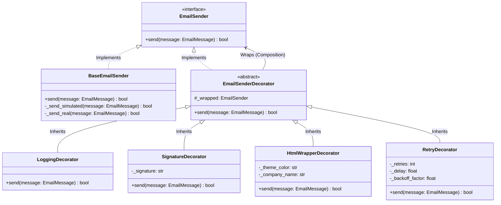

# Sistema de Envío de Correos con Patrón Decorator (tallerCorreo)

Este proyecto implementa un sistema flexible y altamente extensible para el envío de correos electrónicos en Python utilizando el **Patrón Decorator**. El código cumple rigurosamente con los estándares de estilo **PEP 8**, los principios de diseño **SOLID** y las mejores prácticas de **Clean Code**.

---

## 🚀 ¿Qué es el Patrón Decorator y por qué se utiliza aquí?

El **patrón Decorator** es un patrón de diseño estructural que permite añadir funcionalidades a un objeto dinámicamente sin alterar su estructura o el comportamiento de otros objetos de la misma clase.

### ¿Por qué es útil para un sistema de correos?
En lugar de tener una sola clase gigantesca de envío de correo que intente resolver la encriptación, las firmas, las plantillas HTML, los registros de auditoría y los reintentos (lo cual violaría el principio de responsabilidad única - SRP), el patrón Decorator nos permite separar cada una de estas características en pequeñas clases individuales y enfocadas (Decoradores).

Luego, en tiempo de ejecución, podemos combinar dinámicamente estas funcionalidades envolviendo unas dentro de otras:
- ¿Quieres solo enviar un correo plano? Usas `BaseEmailSender`.
- ¿Quieres registrar logs y añadir firma? Creas `LoggingDecorator(SignatureDecorator(BaseEmailSender))`.
- ¿Quieres una plantilla premium en HTML, firma en HTML, reintentos y logs? Creas:
  ```python
  LoggingDecorator(
      RetryDecorator(
          SignatureDecorator(
              HtmlWrapperDecorator(BaseEmailSender)
          )
      )
  )
  ```

---

## 📊 Arquitectura del Sistema (Diagrama de Clases Mermaid)



---

## 🛠️ Cumplimiento de Principios SOLID y Clean Code

1. **Single Responsibility Principle (SRP):**
   - `EmailMessage` se enfoca únicamente en almacenar la información del correo.
   - `BaseEmailSender` solo se encarga de transmitir los bytes al servidor SMTP (o simular el archivo).
   - Cada decorador tiene una única tarea específica (Logs, Firma, Plantilla HTML, Reintentos).
2. **Open/Closed Principle (OCP):**
   - Si deseas añadir una nueva funcionalidad (por ejemplo, encriptación AES del correo), puedes crear una nueva clase `EncryptionDecorator` que extienda de `EmailSenderDecorator` sin modificar ninguna de las clases existentes.
3. **Liskov Substitution Principle (LSP):**
   - El cliente de alto nivel (`main.py`) puede interactuar con cualquier combinación de decoradores de la misma manera que interactúa con el componente concreto, ya que todas las capas respetan estrictamente la firma `send(self, message: EmailMessage) -> bool` de la interfaz `EmailSender`.
4. **Interface Segregation Principle (ISP):**
   - La abstracción `EmailSender` define el método mínimo necesario (`send`) que requiere el cliente. No hay métodos sobrantes o innecesarios.
5. **Dependency Inversion Principle (DIP):**
   - Los decoradores y la aplicación dependen de la interfaz abstracta `EmailSender`, nunca de la clase concreta `BaseEmailSender`.
6. **Clean Code & PEP 8:**
   - Tipado estático con `typing` en todos los métodos.
   - Nombres descriptivos y legibles para variables, métodos y clases.
   - Manejo adecuado de excepciones sin tragar errores.
   - Inmutabilidad: los decoradores clonan el mensaje original mediante `copy.deepcopy` antes de modificarlo para evitar efectos secundarios inesperados.

---

## 📁 Estructura del Directorio

El proyecto está estructurado de forma modular y limpia:
```text
tallerCorreo/
│
├── .env                    # Variables de entorno SMTP locales (generado)
├── .env.example            # Plantilla para variables de entorno SMTP
├── .gitignore              # Ignora entornos virtuales, logs y credenciales .env
├── config.py               # Cargador centralizado de variables de entorno
├── main.py                 # Orquestador y demostración de los casos de uso
├── requirements.txt        # Dependencias de desarrollo (python-dotenv)
├── README.md               # Esta documentación
│
├── src/
│   ├── __init__.py
│   ├── models.py           # Dataclass EmailMessage
│   │
│   ├── sender/
│   │   ├── __init__.py
│   │   ├── interface.py    # Abstracción EmailSender
│   │   └── base.py         # Implementación SMTP de BaseEmailSender
│   │
│   └── decorators/
│       ├── __init__.py
│       ├── base_decorator.py     # Decorador base abstracto
│       ├── logging_decorator.py  # Decorador para auditoría
│       ├── signature_decorator.py # Decorador para añadir firmas
│       ├── html_decorator.py      # Decorador para aplicar diseño HTML
│       └── retry_decorator.py     # Decorador para reintentar fallos
│
└── tests/
    ├── __init__.py
    └── test_decorators.py  # Suite de pruebas unitarias e integración completas
```

---

## 🚀 Guía de Instalación y Uso

### 1. Requisitos Previos
Asegúrate de tener instalado Python 3.8 o superior.

### 2. Clonar el repositorio y configurar el entorno
Si aún no estás dentro de la carpeta:
```bash
git clone https://github.com/DanaSofia12/tallerCorreo_Dana_Sanchez.git
cd tallerCorreo_Dana_Sanchez
```

Crea e instala el entorno virtual:
```bash
# Crear entorno virtual
python -m venv venv

# Activar en Windows:
venv\Scripts\activate

# Instalar dependencias
pip install -r requirements.txt
```

### 3. Modo Simulación (Predeterminado)
Por defecto, el proyecto viene configurado en **Modo Simulación** (`SMTP_SIMULATION=True` en `.env`). Esto significa que:
* No necesitas credenciales reales de correo electrónico de inmediato.
* El sistema imprimirá los correos con un formato claro en consola.
* Los archivos de correo resultantes se guardarán en la carpeta `output/` en formato `.txt` o `.html` para que puedas abrirlos en tu navegador y ver el diseño premium autogenerado.
* Los registros de auditoría se guardarán en la carpeta `logs/email_system.log`.

### 4. Modo Envío Real (Opcional)
Si deseas realizar envíos reales al correo de destino (`dsofia0528@gmail.com`), edita tu archivo `.env` configurando tus credenciales SMTP:
```env
SMTP_SIMULATION=False
SMTP_HOST=smtp.gmail.com
SMTP_PORT=587
SMTP_USER=tu_correo@gmail.com
SMTP_PASSWORD=tu_contraseña_de_aplicación
SMTP_USE_TLS=True
```
*(Nota: Para Gmail, debes generar una "Contraseña de aplicación" desde la configuración de seguridad de tu cuenta Google).*

### 5. Ejecutar la Demostración
Corre el script principal para observar los tres casos descritos:
```bash
python main.py
```

### 6. Ejecutar las Pruebas Unitarias
Para asegurar que todo el sistema y sus decoradores funcionen a la perfección, corre las pruebas unitarias:
```bash
python -m unittest discover -s tests -p "test_*.py"
```
